AI-IOT-HomeAssist是基于AI控制的智能控制系统，可广泛应用于IOT，智能家居控制等，依托后端AI智能体可实现自然语言或语音指令控制。

## 原型说明和部署可参照

[IoT自建MQTT远程控制系统完整项目包]: IoT自建MQTT远程控制系统完整项目包.docx。

## 程序目录结构

程序模块目录结构如下，每个程序模块目录下有详细的部署和使用说明：

​	iot-web-ai：服务端及H5前端

​	ESP：基于ESP8266/ESP32的设备控制，Arduino程序样例

​	HarmonyOS-ArkTS：华为鸿蒙手机端程序

​	xiaoai-node：与小米小爱音箱集成的AI语音控制集成

## 简明操作步骤：

### 设备管理

#### 1、添加设备

- 用浏览器访问设备管理服务端：http://xxx.xxx.xxx.xxx:6001，（端口在配置文件.env中配置）输入设备名称（英文），设备显示名称（中文、英文），设备位置。

  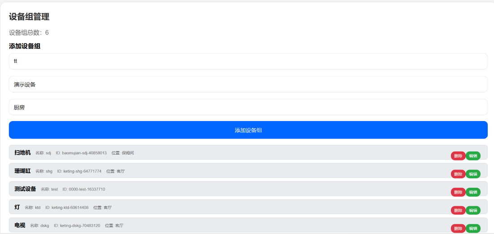

  

- 点击添加设备组按钮，完成设备定义，设备将显示在设备列表中

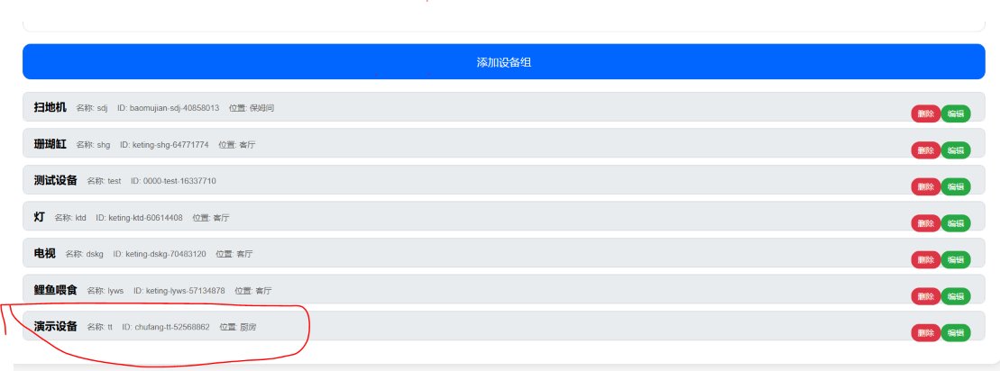

- 点击新添加的设备，显示设备单元定义，输入名称，类型，状态，点击添加设备单元按钮添加控制设备。

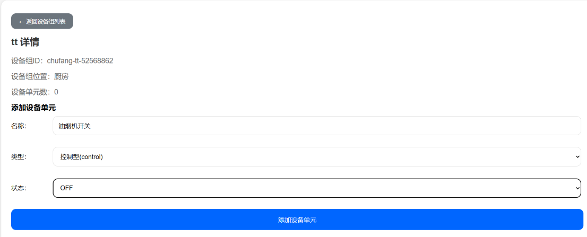

- 设备类型分为：
  - 控制型，主要用于开关设备，状态为ON/OFF
  - 数据型，主要用于接收数据，例如温度传感器的温度值，烟雾传感器的浓度
  - 状态型和文本型，主要用于作为条件控制设备，例如天气为晴天时，打开开关设备；温度超过30度打开空调等等

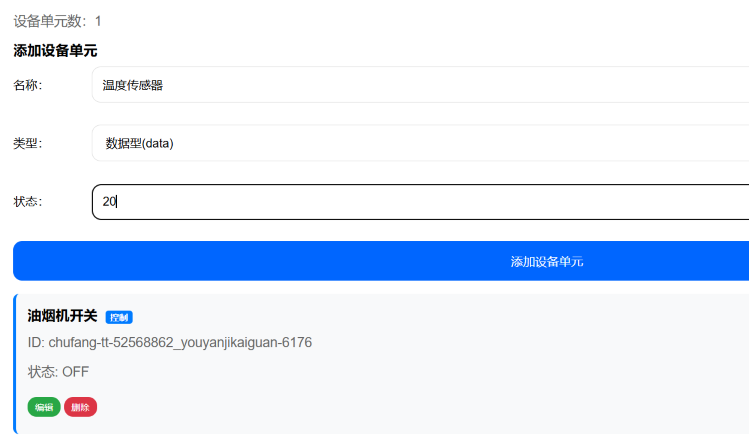

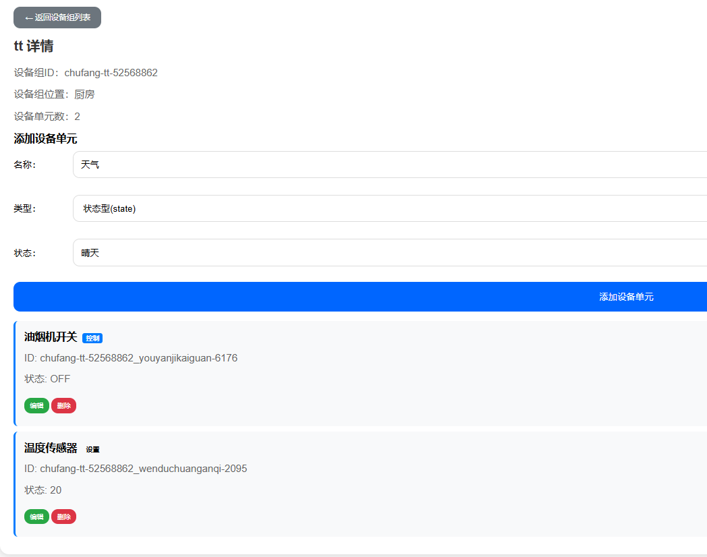

### 2、设备的修改和删除

- 点击相应设备组后边的修改按钮可以修改设备组定义

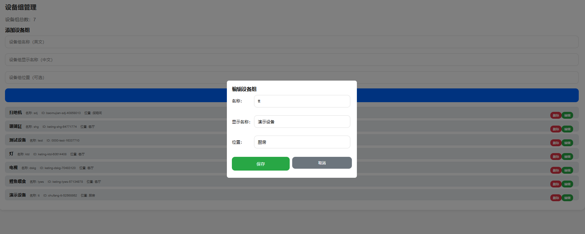

- 点击相应设备组后边的删除按钮可以删除设备组及所属所有控制单元

- 点击设备组列表，进入设备组，可以修改和删除设备单元

  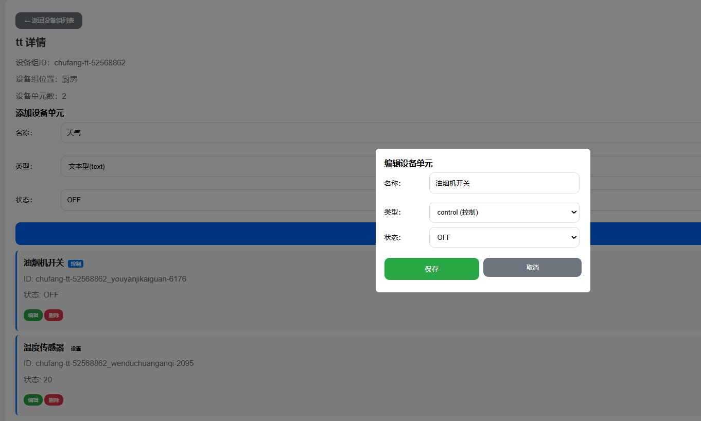

### 设备控制（H5）

- 用浏览器访问设备管理服务端：http://xxx.xxx.xxx.xxx:6001，（端口在配置文件.env中配置)。页面中将显示所有管理设备的状态：

  - 黑色-设备组所有控制设备单元都为关闭（OFF）

  - 灰色-设备组的设备单元为离线状态，不能进行控制

  - 绿色-设备组所有控制设备都为打开（ON）

  - 橘色-设备组中部分控制设备为打开（ON），部分为关闭（OFF）

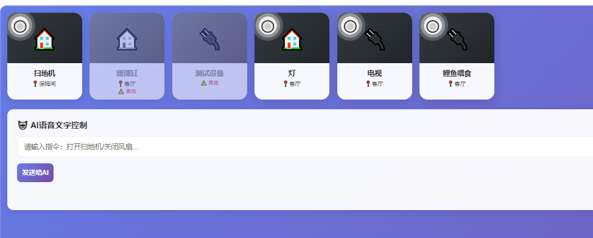

- 点击每个设备左上角的开关可打开或关闭设备组内所有设备控制单元
- 点击设备组可进入控制单个控制单元：
- 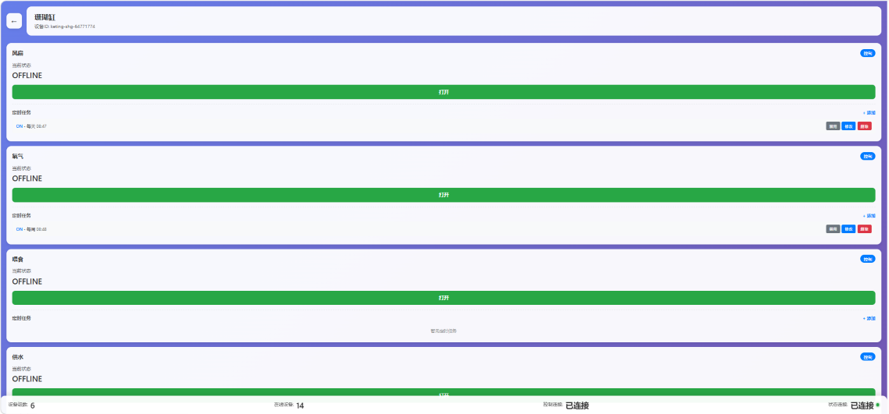
- 长按设备组图标，可进行定时任务设置，可选择不同的控制设备单元，以天，周，重复周期，一次性进行自动的设备单元控制，例如每天19:00开电视，22:00关电视；每周日下午13:00打开扫地机；每周1,3,5早8:30和下午14:30给鱼喂食等等

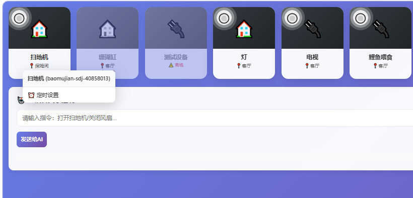

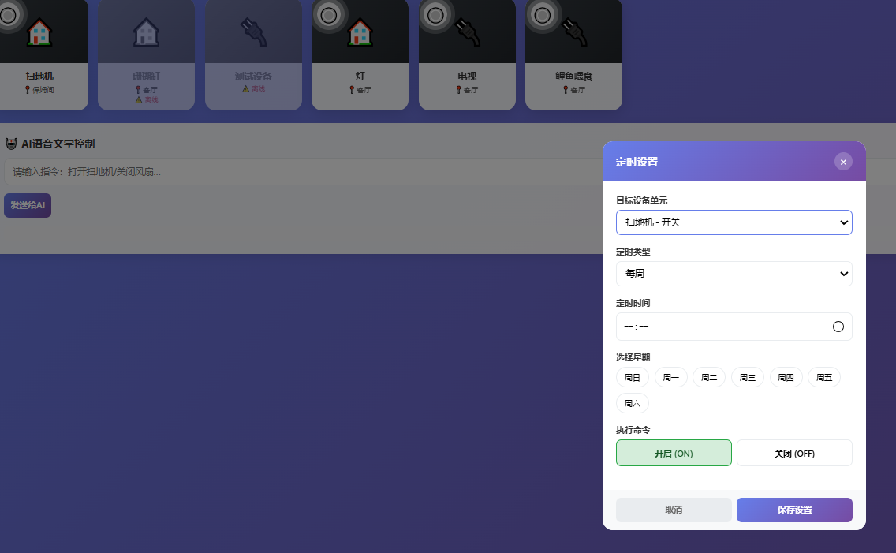

- 定时任务定义完后，显示在对应设备单元里表中，可进行启用、禁用（enable/disable），修改，删除操作

- 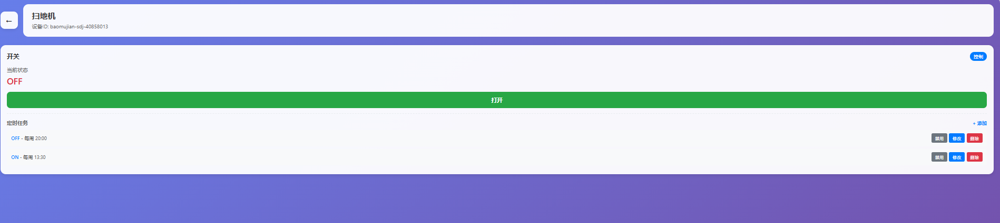

### 基于AI的自然语言（NLP）控制设备（H5）

- 系统提供了基于自然语言控制设备的能力，例如在AI语言文字控制输入框输入“打开电视”，“关闭扫地机”，”打开客厅灯“，”打开电视和灯“等以自然语言描述的指令，系统会根据要求控制相应设备。同时也可与语音输入设备例如智能音箱（小爱音箱）集成，通过自然语言对话控制设备

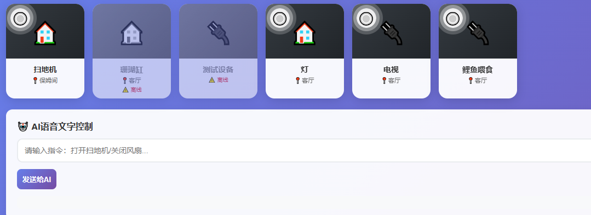

## 移动端控制设备

使用移动端管理设备视频:

[Mobile]:[ https://github.com/mahongmagu/AI-IOT-HomeAssist/blob/main/Mobile%20App.mp4](https://github.com/mahongmagu/AI-IOT-HomeAssist/blob/main/Harmony%20App%20720.mp4)	"终端app demo视频"

